```

<p align="center">
  <a href="README.md">🇺🇸 English</a> |
  <a href="README_TR.md">🇹🇷 Türkçe</a>
</p>

  _____ ____  ____    _____         _   _             
 |_   _/ __ \/ ___|  |_   _|__  ___| |_(_)_ __   __ _ 
   | || |  | \___ \    | |/ _ \/ __| __| | '_ \ / _` |
   | || |__| |___) |   | |  __/\__ \ |_| | | | | (_| |
  _|_|_\____/|____/    |_|\___||___/\__|_|_| |_|\__, |
 |  ___|_ __ __ _ _ __ ___   _____      _____  _ _|___/
 | |_ | '__/ _` | '_ ` _ \ / _ \ \ /\ / / _ \| '__| |/ /
 |  _|| | | (_| | | | | | |  __/\ V  V / (_) | |  |   < 
 |_|  |_|  \__,_|_| |_| |_|\___| \_/\_/ \___/|_|  |_|\_\
```

<p align="center">
  <strong>Enterprise-grade testing infrastructure for iOS applications</strong>
</p>

<p align="center">
  <a href="https://github.com/muhittincamdali/iOS-Testing-Automation-Framework/actions/workflows/ci.yml">
    
  </a>
  <a href="https://swift.org">
    
  </a>
  <a href="https://developer.apple.com/ios/">
    
  </a>
  <a href="https://swift.org/package-manager/">
    
  </a>
  <a href="LICENSE">
    
  </a>
  <a href="https://codecov.io/gh/muhittincamdali/iOS-Testing-Automation-Framework">
    
  </a>
</p>

<p align="center">
  <a href="#-quick-start">Quick Start</a> •
  <a href="#-features">Features</a> •
  <a href="#-test-pyramid">Test Pyramid</a> •
  <a href="#-examples">Examples</a> •
  <a href="#-ci-integration">CI Integration</a>
</p>

---

## 📋 Table of Contents

- [Why This Framework?](#-why-this-framework)
- [Quick Start](#-quick-start)
- [Features](#-features)
- [Test Pyramid](#-test-pyramid)
- [Examples](#-examples)
- [CI Integration](#-ci-integration)
- [Contributing](#contributing)
- [License](#license)
- [Star History](#-star-history)

---

## 🎯 Why This Framework?

Testing iOS apps shouldn't be painful. This framework gives you battle-tested patterns, utilities, and infrastructure to write tests that are:

- **Fast** — Parallel execution, smart caching, minimal setup
- **Reliable** — No flaky tests, deterministic results
- **Maintainable** — Page objects, fluent APIs, clear patterns
- **Comprehensive** — Unit, integration, UI, snapshot, performance

---

## 🚀 Quick Start

### Installation

Add to your `Package.swift`:

```swift
dependencies: [
    .package(url: "https://github.com/muhittincamdali/iOS-Testing-Automation-Framework.git", from: "1.0.0")
]
```

### Basic Usage

```swift
import XCTest
import iOSTestingAutomationFramework

final class MyFirstTest: XCTestCase {
    func testExample() {
        let calculator = Calculator()
        XCTAssertEqual(calculator.add(2, 3), 5)
    }
}
```

---

## 📐 Test Pyramid

```mermaid
graph TB
    subgraph pyramid[" "]
        direction TB
        E2E["🔺 E2E Tests<br/>~5% | Slowest | Critical paths"]
        INT["🔷 Integration Tests<br/>~15% | Medium | API & DB"]
        UNIT["🟩 Unit Tests<br/>~80% | Fastest | Business logic"]
    end
    
    E2E --> INT
    INT --> UNIT
    
    style E2E fill:#ff6b6b,stroke:#c92a2a,color:#fff
    style INT fill:#4dabf7,stroke:#1971c2,color:#fff
    style UNIT fill:#51cf66,stroke:#2f9e44,color:#fff
```



| Layer | Coverage | Speed | Focus |
|-------|----------|-------|-------|
| **Unit** | 80% | ⚡ <1ms | Functions, classes, business logic |
| **Integration** | 15% | 🔄 <1s | Services, networking, persistence |
| **E2E/UI** | 5% | 🐢 <30s | Critical user journeys |

---

## ✨ Features

### Unit Testing

- Extended XCTest assertions
- Mock generation utilities
- Async/await test helpers
- Memory leak detection

### UI Testing (XCUITest)

- Page Object pattern
- Robot pattern support
- Accessibility testing
- Element wait utilities

### Snapshot Testing

- Visual regression testing
- Device matrix support
- Diff reporting

### Performance Testing

- CPU & memory metrics
- Baseline comparisons
- Regression detection

---

## 📖 Examples

### Unit Test with Mocking

```swift
import XCTest
@testable import MyApp
import iOSTestingAutomationFramework

final class UserServiceTests: XCTestCase {
    
    private var sut: UserService!
    private var mockAPI: MockNetworkClient!
    
    override func setUp() {
        super.setUp()
        mockAPI = MockNetworkClient()
        sut = UserService(networkClient: mockAPI)
    }
    
    override func tearDown() {
        sut = nil
        mockAPI = nil
        super.tearDown()
    }
    
    func test_fetchUser_withValidID_returnsUser() async throws {
        // Arrange
        let expectedUser = User(id: "123", name: "John Doe", email: "john@example.com")
        mockAPI.stubbedResult = .success(expectedUser)
        
        // Act
        let result = try await sut.fetchUser(id: "123")
        
        // Assert
        XCTAssertEqual(result.id, expectedUser.id)
        XCTAssertEqual(result.name, expectedUser.name)
        XCTAssertEqual(mockAPI.fetchCallCount, 1)
    }
    
    func test_fetchUser_withInvalidID_throwsError() async {
        // Arrange
        mockAPI.stubbedResult = .failure(NetworkError.notFound)
        
        // Act & Assert
        await XCTAssertThrowsError(try await sut.fetchUser(id: "invalid")) { error in
            XCTAssertEqual(error as? NetworkError, .notFound)
        }
    }
}
```

### XCUITest with Page Object Pattern

```swift
import XCTest

// MARK: - Page Objects

protocol Page {
    var app: XCUIApplication { get }
    init(app: XCUIApplication)
}

final class LoginPage: Page {
    let app: XCUIApplication
    
    init(app: XCUIApplication) {
        self.app = app
    }
    
    // MARK: Elements
    
    private var emailTextField: XCUIElement {
        app.textFields["login_email_field"]
    }
    
    private var passwordTextField: XCUIElement {
        app.secureTextFields["login_password_field"]
    }
    
    private var loginButton: XCUIElement {
        app.buttons["login_submit_button"]
    }
    
    private var errorLabel: XCUIElement {
        app.staticTexts["login_error_label"]
    }
    
    // MARK: Actions
    
    @discardableResult
    func typeEmail(_ email: String) -> Self {
        emailTextField.tap()
        emailTextField.typeText(email)
        return self
    }
    
    @discardableResult
    func typePassword(_ password: String) -> Self {
        passwordTextField.tap()
        passwordTextField.typeText(password)
        return self
    }
    
    @discardableResult
    func tapLogin() -> HomePage {
        loginButton.tap()
        return HomePage(app: app)
    }
    
    func tapLoginExpectingError() -> Self {
        loginButton.tap()
        return self
    }
    
    // MARK: Assertions
    
    func assertErrorVisible(message: String) -> Self {
        XCTAssertTrue(errorLabel.waitForExistence(timeout: 5))
        XCTAssertEqual(errorLabel.label, message)
        return self
    }
}

final class HomePage: Page {
    let app: XCUIApplication
    
    init(app: XCUIApplication) {
        self.app = app
    }
    
    private var welcomeLabel: XCUIElement {
        app.staticTexts["home_welcome_label"]
    }
    
    func assertWelcomeVisible(name: String) {
        XCTAssertTrue(welcomeLabel.waitForExistence(timeout: 10))
        XCTAssertTrue(welcomeLabel.label.contains(name))
    }
}

// MARK: - Tests

final class LoginUITests: XCTestCase {
    
    private var app: XCUIApplication!
    
    override func setUp() {
        super.setUp()
        continueAfterFailure = false
        app = XCUIApplication()
        app.launchArguments = ["--uitesting", "--reset-state"]
        app.launch()
    }
    
    func test_login_withValidCredentials_navigatesToHome() {
        LoginPage(app: app)
            .typeEmail("user@example.com")
            .typePassword("validPassword123")
            .tapLogin()
            .assertWelcomeVisible(name: "Welcome")
    }
    
    func test_login_withInvalidCredentials_showsError() {
        LoginPage(app: app)
            .typeEmail("wrong@example.com")
            .typePassword("wrongPassword")
            .tapLoginExpectingError()
            .assertErrorVisible(message: "Invalid credentials")
    }
    
    func test_login_withEmptyFields_showsValidation() {
        LoginPage(app: app)
            .tapLoginExpectingError()
            .assertErrorVisible(message: "Please fill all fields")
    }
}
```

### Snapshot Testing

```swift
import XCTest
import iOSTestingAutomationFramework

final class ProfileViewSnapshotTests: XCTestCase {
    
    func test_profileView_lightMode() {
        let view = ProfileView(user: .mock)
            .frame(width: 375, height: 667)
        
        assertSnapshot(of: view, as: .image(traits: .init(userInterfaceStyle: .light)))
    }
    
    func test_profileView_darkMode() {
        let view = ProfileView(user: .mock)
            .frame(width: 375, height: 667)
        
        assertSnapshot(of: view, as: .image(traits: .init(userInterfaceStyle: .dark)))
    }
    
    func test_profileView_accessibility_extraLargeText() {
        let view = ProfileView(user: .mock)
            .frame(width: 375, height: 800)
            .environment(\.sizeCategory, .accessibilityExtraLarge)
        
        assertSnapshot(of: view, as: .image, named: "accessibility")
    }
}
```

### Performance Testing

```swift
import XCTest
@testable import MyApp

final class PerformanceTests: XCTestCase {
    
    func test_imageProcessing_performance() {
        let processor = ImageProcessor()
        let testImage = UIImage(named: "test_large_image")!
        
        let metrics: [XCTMetric] = [
            XCTClockMetric(),
            XCTMemoryMetric(),
            XCTCPUMetric()
        ]
        
        let options = XCTMeasureOptions()
        options.iterationCount = 5
        
        measure(metrics: metrics, options: options) {
            _ = processor.applyFilters(to: testImage)
        }
    }
    
    func test_dataParser_largeJSON_performance() {
        let parser = DataParser()
        let jsonData = loadTestJSON("large_dataset") // 10MB file
        
        measure {
            _ = try? parser.parse(jsonData)
        }
    }
}
```

---

## 🔄 CI Integration

### GitHub Actions

The framework includes a ready-to-use workflow:

```yaml
# .github/workflows/ci.yml
name: CI

on:
  push:
    branches: [main, develop]
  pull_request:
    branches: [main]

jobs:
  test:
    name: Build & Test
    runs-on: macos-14
    
    steps:
      - uses: actions/checkout@v4
      
      - name: Select Xcode 15
        run: sudo xcode-select -s /Applications/Xcode_15.4.app
      
      - name: Cache SPM
        uses: actions/cache@v4
        with:
          path: .build
          key: ${{ runner.os }}-spm-${{ hashFiles('Package.resolved') }}
      
      - name: Build
        run: swift build
      
      - name: Run Tests
        run: |
          xcodebuild test \
            -scheme iOSTestingAutomationFramework \
            -destination 'platform=iOS Simulator,name=iPhone 15,OS=17.5' \
            -resultBundlePath TestResults.xcresult \
            CODE_SIGN_IDENTITY="" \
            CODE_SIGNING_REQUIRED=NO
      
      - name: Upload Results
        uses: actions/upload-artifact@v4
        if: failure()
        with:
          name: test-results
          path: TestResults.xcresult
```

### Xcode Cloud

```yaml
# ci_scripts/ci_post_clone.sh
#!/bin/bash
set -e

# Install dependencies
swift package resolve

# Run linting
if which swiftlint > /dev/null; then
    swiftlint
fi
```

### Bitrise

```yaml
# bitrise.yml
workflows:
  test:
    steps:
      - git-clone: {}
      - cache-pull: {}
      - xcode-test@4:
          inputs:
            - scheme: iOSTestingAutomationFramework
            - simulator_device: iPhone 15
      - cache-push: {}
      - deploy-to-bitrise-io@2: {}
```

---

## 📂 Project Structure

```
iOS-Testing-Automation-Framework/
├── Sources/
│   ├── Core/                    # Framework core
│   │   ├── TestConfiguration.swift
│   │   ├── TestExecutor.swift
│   │   ├── TestReporter.swift
│   │   └── PerformanceMonitor.swift
│   └── Testing/
│       ├── UITestSuite.swift
│       └── TestAutomationManager.swift
├── Tests/
│   └── FrameworkTests/          # Framework tests
├── Examples/
│   ├── BasicExamples/
│   ├── AdvancedExamples/
│   └── PerformanceExamples/
├── Documentation/               # Full docs
└── .github/
    └── workflows/
        └── ci.yml               # CI pipeline
```

---

## 📋 Requirements

| Requirement | Version |
|-------------|---------|
| iOS | 15.0+ |
| macOS | 12.0+ |
| Xcode | 15.0+ |
| Swift | 5.9+ |

---

## 🤝 Contributing

Contributions are welcome! Please read [CONTRIBUTING.md](CONTRIBUTING.md) for guidelines.

1. Fork the repo
2. Create your branch (`git checkout -b feature/awesome-feature`)
3. Commit changes (`git commit -m 'feat: add awesome feature'`)
4. Push (`git push origin feature/awesome-feature`)
5. Open a Pull Request

---

## 📄 License

MIT License - see [LICENSE](LICENSE) for details.

---

## 👨‍💻 Author

**Muhittin Camdali**

[](https://github.com/muhittincamdali)
[](https://linkedin.com/in/muhittincamdali)

---

<p align="center">
  <sub>Built with ☕ and countless test runs</sub>
</p>

---

## 📈 Star History

<a href="https://star-history.com/#muhittincamdali/iOS-Testing-Automation-Framework&Date">
 <picture>
   <source media="(prefers-color-scheme: dark)" srcset="https://api.star-history.com/svg?repos=muhittincamdali/iOS-Testing-Automation-Framework&type=Date&theme=dark" />
   <source media="(prefers-color-scheme: light)" srcset="https://api.star-history.com/svg?repos=muhittincamdali/iOS-Testing-Automation-Framework&type=Date" />
   
 </picture>
</a>
